

**WYDZIAŁ MATEMATYKI STOSOWANEJ**

Kierunek: Informatyka

**Programowanie obiektowe i graficzne**

**Dokumentacja projektu zaliczeniowego**

  ----------------- ------------------------------------------------------------
    Tytuł projektu: Zaawansowane planowanie dnia oraz monitorowanie aktywności
        Prowadzący: Dr hab. inż. prof. PŚ Adam Zielonka
             Grupa: 3.6
  ----------------- ------------------------------------------------------------

  ---------------------- --
  Autorzy:               
  1\. Błażej Skorzysko   
  2\. Paweł Sołtysik     
  3\. Bartosz Więcek     
  ---------------------- --

Gliwice, 2026-07-02
:::
::::

# Cel projektu

## Opis problemu

Aplikacja to inteligentny, oparty na kalendarzu system do zarządzania
czasem, zadaniami, listami oraz miejsce śledzenia codziennych nawyków.

## Cel aplikacji

Głównym celem jest ułatwienie planowania dnia poprzez łączenie zadań
twardych, czyli takich, które muszą zostać wykonane w podanym czasie, z
miękkimi, czyli takimi, które mogą automatycznie znaleźć sobie nowy
termin wykonania w sposób inteligentny (pominięcie zajętych godzin,
godzin nocnych). Aplikacja posiada wbudowany moduł do monitorowania
jakości dnia (czasu spędzonego na pracy, czasu spędzonego na świeżym
powietrzu, czasu aktywności).

# Wymagania

## Wymagania funkcjonalne

- Zarządzanie kalendarzem i wydarzeniami

- Widok kalendarza

- Dodawanie, usuwanie i edycja wydarzeń

- Algorytm przenoszący wydarzenie na dogodny termin

- Zintegrowany moduł list TODO

- Możliwość dodania oraz formatowania listy TODO

- Możliwość podpięcia listy pod dane wydarzenie

- Kategoryzacja zdarzeń

- Odczytywanie typu wydarzenia (aktywność fizyczna, praca, ...)

- Zliczanie oraz analizowanie danych

- Inteligentne zarządzanie wydarzeniami miękkimi

- Monitorowanie oraz zapytanie użytkownika, czy to wydarzenie zostało
  wykonane

- Zarządzanie kontami użytkownika

- Login oraz hasło

- Uprawnienia do kalendarzy

## Wymagania niefunkcjonalne

- Język programowania C#

- Architektura MVP

- Programowanie obiektowe

- Graficzny interfejs użytkownika

- Przechowywanie danych w bazie danych

# Analiza i projekt systemu

## Model danych

### Diagram związków encji

<figure data-latex-placement="H">
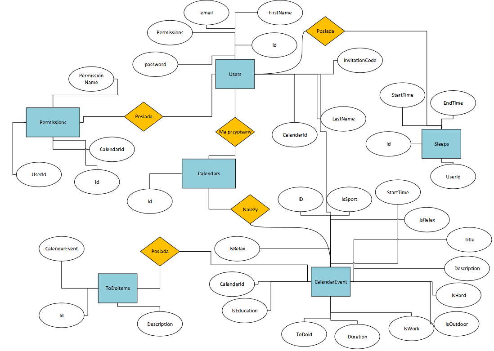
<figcaption>Diagram Encji</figcaption>
</figure>

### Model relacyjny

<figure data-latex-placement="htbp">

<figcaption>Schemat bazy danych</figcaption>
</figure>

## Diagram klas

<figure data-latex-placement="H">
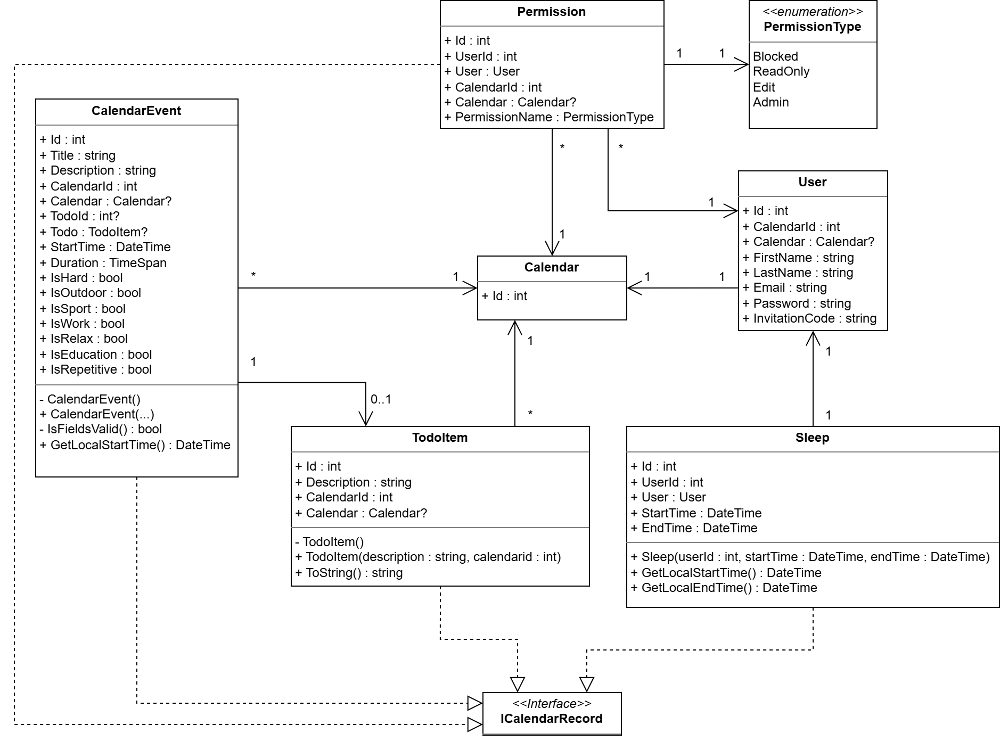
<figcaption>Model danych</figcaption>
</figure>

<figure data-latex-placement="H">
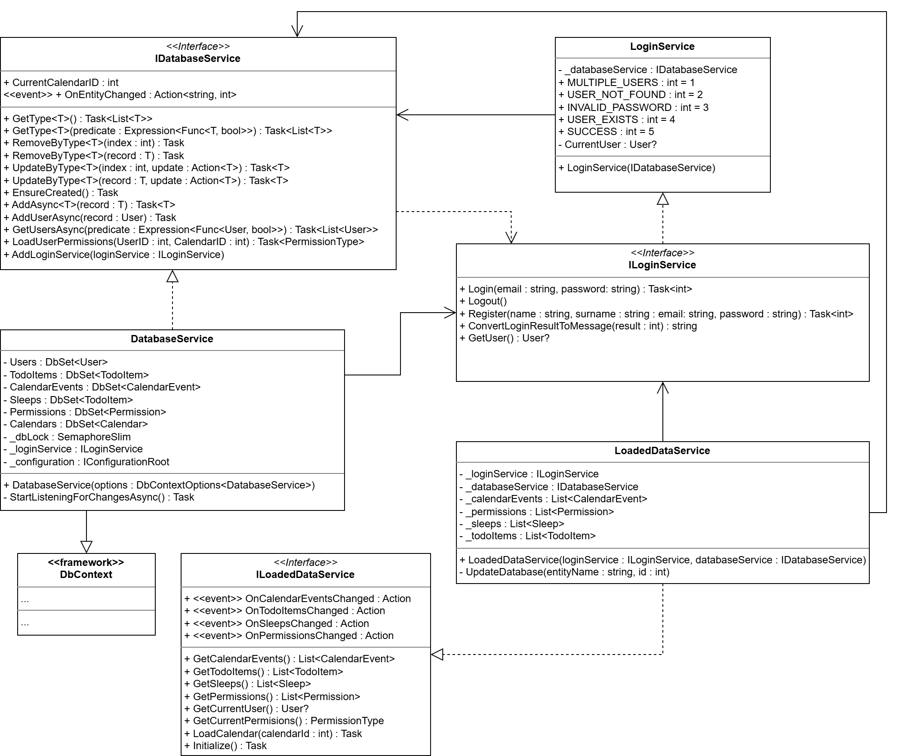
<figcaption>Związki pomiędzy klasami odpowiedzialnymi za przechowywanie
danych</figcaption>
</figure>

<figure data-latex-placement="H">
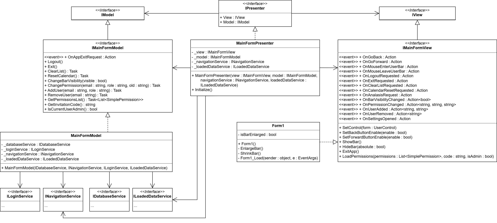
<figcaption>Związki pomiędzy klasami tworzącymi główny
formularz</figcaption>
</figure>

<figure data-latex-placement="H">
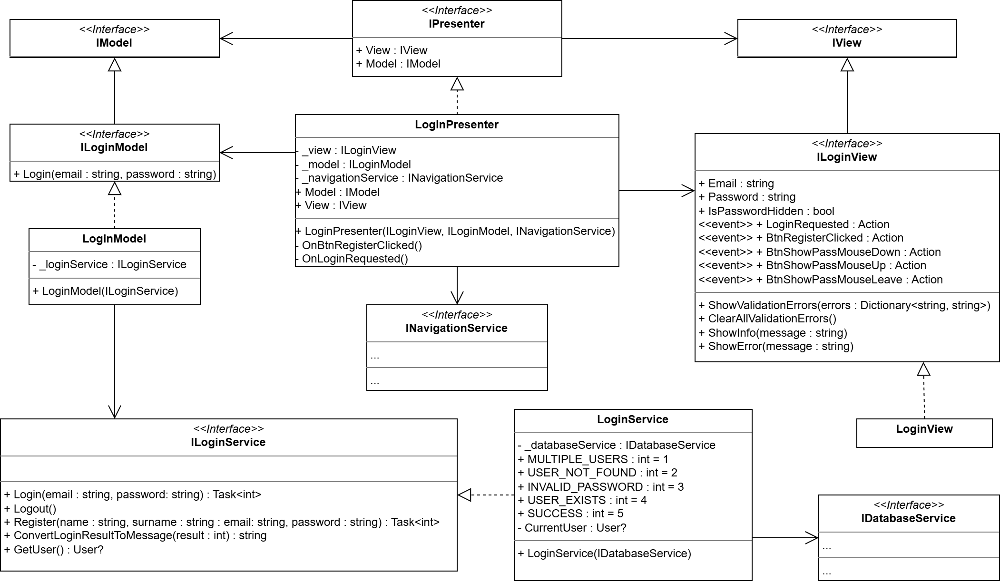
<figcaption>Związki pomiędzy klasami składającymi się na system
logowania</figcaption>
</figure>

<figure data-latex-placement="H">
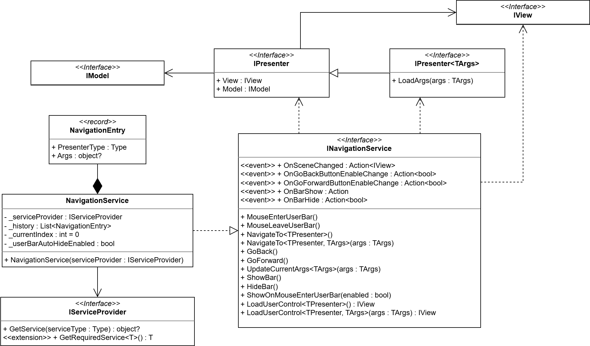
<figcaption>System nawigacji</figcaption>
</figure>

<figure data-latex-placement="H">
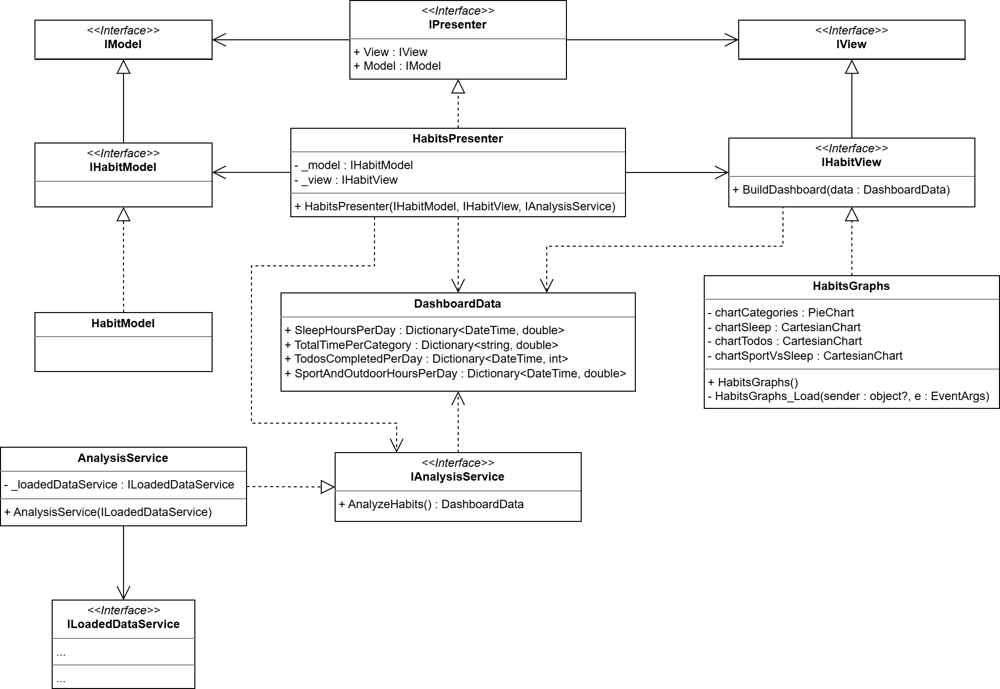
<figcaption>Związki pomiędzy klasami tworzącymi formularz analizy
naywków</figcaption>
</figure>

## Opis klas

  **Klasa**                         **Opis**
  --------------------------------- -------------------------------------------------------------------------------------------
  CalendarModel                     Obsługuje logikę kontrolki kalendarza
  CalendarPresenter                 Łączy i zarządza widokiem kalendarza z modelem
  CalendarUserControl               Widok Kalendarza
  DayCellUserControl                Kontrolka pojedynczego okienka w kalendarzu
  DayClickedEvent                   Dane przekazywane przy wywołaniu zdarzenia kliknięcia w okienko
  DayModel                          Obsługuje logikę kontrolki dnia
  DayPresenter                      Łączy i zarządza widokiem dnia z modelem
  DayUserControl                    Widok Kalendarza
  CalendarEventPreviewUserControl   Kontrolka pojedynczego wydarzenia w dniu
  CalendarEventClickedEventArgs     Dane przekazywane przy wywołaniu zdarzenia kliknięcia w wydarzenie
  TaskModel                         Obsługuje logikę kontrolki wydarzenia
  TaskPresenter                     Łączy i zarządza widokiem wydarzenia z modelem
  TaskUserControl                   Widok wydarzenia
  FieldValidationEventArgs          Dane przekazywane przy walidacji zmian w wydarzeniu
  Form1                             Główne okno aplikacji. Obsługuje ładowanie innych widoków oraz pasek użytkownika
  LoginForm                         Okno logowania
  RegisterForm                      Okno rejestracji
  SelectCalendarForm                Okno dołączania oraz wczytywania kalendarza
  HabitsGraphs                      Odpowiada za wyświetlanie danych w przyjaznym dla użytkownika formacie
  DatabaseService                   Obsługuje połączenie z bazą danych oraz operację na niej
  AnalysisService                   Odpowiada za wyciąganie oraz analizowanie danych użytkownika
  LoadedDataService                 Odpowiada za trzymanie danych potrzebnych pod ręką, aby przyśpieszyć ładowanie
  LoginService                      Odpowiada za sprawdzanie danych użytkownika oraz dodawanie nowego
  NavigationService                 Odpowiada za przechodzenie między kontrolkami oraz trzymanie historii otwartych kontrolek

## Zastosowane relacje UML

- Asocjacja

  - Wykorzystywana masowo do reprezentowania trwałych referencji między
    warstwami systemu.

  - Prezenterzy przechowujący referencje do swoich widoków i modeli.
    Przykład: powiązania klasy `MainFormPresenter` z interfejsami
    `IMainFormView` i `IMainFormModel` w relacji 1 do 1.

  - Poszczególne klasy reprezentujące model przechowują referencję do
    wykorzystywanych usług. Przykład: powiązania klasy `LoginModel` z
    interfejsem usługi `ILoginService`.

  - Związki występujące pomiędzy elementarnymi klasami składającymi się
    na model danych. Przykład: `Calendar` i `CalendarEvent` to asocjacja
    typu Jeden-do-Wielu.

- Agregacja

  - Stosowana do opisania klas przechowujących kolekcje obiektów
    domenowych, które zostały pobrane z bazy, ale ich cykl życia jest od
    tej klasy niezależny. Przykład: listy `List<CalendarEvent>`,
    `List<TodoItem>`, `List<Sleep>` przechowywane wewnątrz serwisu
    `LoadedDataService`.

- Kompozycja

  - Wykorzystywana w miejscach, gdzie obiekty podrzędne są fizyczną i
    logiczną częścią obiektu nadrzędnego i nie mogą istnieć
    samodzielnie. Przykład: struktura stosu historii w
    `NavigationService` (zarządzanie rekordami `NavigationEntry`).

- Dziedziczenie

  - Wskazuje na rozszerzanie standardowych bibliotek środowiska .NET.
    Przykład: dziedziczenie `DatabaseService` po klasie `DbContext`
    (Entity Framework) oraz dziedziczenie widoków po klasie
    `UserControl` (Windows Forms).

  - Polimorfizm interfejsów i standaryzacja kontraktów. Przykład:
    `IMainFormModel` i `IHabitModel` dziedziczące po wspólnym,
    abstrakcyjnym interfejsie `IModel`.

- Zależność (Dependency)

  - Modeluje powiązania z obiektami używanymi jednorazowo wewnątrz
    metod, bez utrwalania ich stanu.

  - Tworzenie i zwracanie obiektu `DashboardData` (DTO) przez klasę
    `AnalysisService`.

  - Korzystanie przez klasę `NavigationService` oraz implementowany
    przez nią interfejs z typów `IPresenter`, `IView`.

  - Sytuacje, w których serwis jest podawany tylko jako argument
    konstruktora. Przykład: znajomość `IAnalysisService` przez
    `HabitsPresenter`.

- Realizacja interfejsów

  - Kluczowa relacja organizująca architekturę MVP i testowalność kodu.

  - Wszystkie klasy usług realizują zdefiniowane dla nich kontrakty.
    Przykłady: `LoadedDataService` implementująca `ILoadedDataService`,
    `DatabaseService` implementująca `IDatabaseService`.

  - Wszystkie widoki realizują swoje dedykowane interfejsy. Przykłady:
    `IHabitView`, `IMainFormView`, `ILoginView`.

  - Każdy prezenter implementuje interfejs `IPresenter`.

# Implementacja

## Wykorzystane technologie

- C#

- .NET

- Windows Forms

- Visual Studio

- Git

- GitHub

- xUnit, Moq oraz EntityFrameworkCore InMemory

- PostgreSQL

- Baza danych neon.com

- LiveChartsCore

- Microsoft Dependency Injection

## Struktura projektu

### Podział struktury

Projekt został podzielony na 3 główne części.

- Typy danych

- Serwisy

- Widoki

Typy danych opisują sposób przechowywania przez nas informacji o
użytkownikach oraz o wydarzeniach i kalendarzach.\
Każdy serwis ma wyspecjalizowane zadanie, które pozwala utrzymać w
logicę widoków minimalną ilość kodu, niedotyczącą samego wyświetlania.
Mamy serwisy odpowiedzialne za połączenie z bazą danych oraz
utrzymywanie i analizę danych, serwisy odpowiedzialne za logowanie oraz
najważniejszę, serwis odpowiedzialny za nawigację po aplikacji.\
Widoki zostały zaprojektowane zgodnie z architektórą MVP. Każdy ma swój
model, prezenter oraz widok. Aby zachować struktórę, mamy interfejsy dla
każdej z tych klas.

### Struktury

    DayTracker
    ├───Common
    ├───Database
    │   └───Datatypes
    ├───DayTracker.Tests
    │   ├───Database
    │   ├───Forms
    │   └───HabitAnalysis
    ├───Forms
    │   ├───Calendar
    │   ├───Day
    │   │   └───TaskPreview
    │   ├───Habits
    │   ├───LoginForm
    │   ├───MainForm
    │   ├───RegisterForm
    │   ├───SelectCalendarForm
    │   ├───TaskControl
    │   └───TestForm
    ├───HabitAnalysis
    ├───LoadedData
    ├───LoginServices
    ├───Navigation
    ├───Resources
    └───UserControls
        ├───ToDoControl
        └───UserBar

## Najważniejsze klasy

### CalendarEvent

Klasa przechowująca informacje o zdarzeniu w kalendarzu

### User

Klasa przechowująca informacje o użytkowniku

### LoadedDataService

Klasa automatycznie zapisująca lokalnie potrzebne fragmenty bazy danych
w celu zmniejszenia ilości żądań oraz oczekiwania. Pozwala
synchronicznie wczytywać dane z tabeli oraz reagować na potencjalne
zmiany z innych urządzeń.

### NavigationService

Klasa pozwalająca na zmianę aktywnego widoku aplikacji. Pozwala na
przekazanie parametrów do nowo utworzonego prezentera. Zachowuje
historię wczytanych kontrolek, co pozwala jej na cofanie do ostatnio
załadowanej kontrolki.

### DatabaseService

Klasa odpowiedzialna za połączenie z bazą danych poprzez wczytany ciąg
znaków. Pozwala na dodawanie obiektów do tabeli, usuwanie, wczytywanie
wraz z filtrowaniem oraz usuwanie elementów. Klasa automatycznie ustawia
parametry takie jak wymagane CalendarID. Dodatkowo nasłuchuje na zmiany
we wszystkich tabelach, filtruje te zmiany oraz pozwala aplikacji
odpowiednio na nie reagować.

### LoginService

Serwis odpowiedzialny za logowanie oraz rejestrowanie nowych
użytkowników. W przypadku rejestracji sprawdza wszystko możliwe
sprzeczności, takie jak duplikaty w adresie e-mail. Podczas logowania
zwraca wszystkie możliwe błędy (brak użytkownika, niepoprawne hasło). Po
poprawnej próbie logowania zapamiętuje id użytkownika.

### AnalysisService

Serwis odpowiedzialny za analizę danych nagromadzonych przez
użytkownika. Tworzy zestawienie snu, liczbę wykonanych zadań,
zestawienie ze względu na kategorię wydarzeń oraz stosunek ilości snu do
aktywności fizycznej.

### CalendarPresenter

Klasa odpowiedzialna za obsłużenie zdarzeń z widoku kalendarza i
przekazanie mu odpowiednich calendarEvent's do wyświetlenia.
Wykorzystując odpowiednie metody z CalendarModel wczytuje adekwatne
wydarzenia dla miesiąca, sprawdza stan wprowadzenia informacji o śnie i
umożliwia ich aktualizacje, przekazuje informacje do widoku o ułożeniu
dni w danym miesiącu. Podczas wczytania kalendarza wywołuje odpowiednie
metody, które aktualizują miękkie i powtarzalne wydarzenia.

### DayPresenter

Klasa odpowiedzialna za przekazanie odpowiednich danych do widoku dnia.
Wykorzystując DayModel wczytuje wydarzenia dla danego dnia, oblicza ich
umiejscowienie, oraz obsługuje kliknięcie w konkretne wydarzenie.

### TaskPresenter

Klasa zarządzająca przekazaniem do widoku wydarzenia odpowiednich
informacji. Z wykorzystaniem TaskModel waliduje również zmiany dokonane
przez użytkownika w widoku. Obsługuje również zapis zmian/nowego
wydarzenia za pośrednictwem modelu.

# Interfejs użytkownika i instrukcja użytkownika

## Okno główne

<figure data-latex-placement="H">
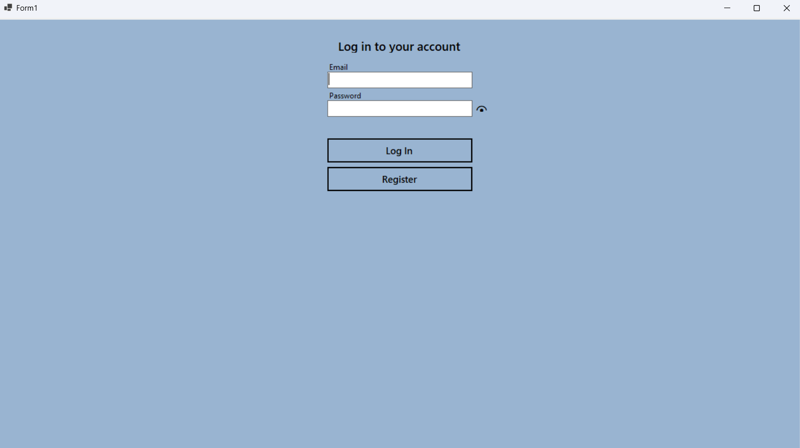
<figcaption>Okno główne</figcaption>
</figure>

## Pozostałe okna

- **Okno wyboru kalendarza** pozwala na dołączenie do czyjegoś
  kalendarza lub otworzenie swojego.

- **Okno kalendarza** wyświetla kalendarz wraz ze wszystkimi zadaniami
  na dany miesiąc. Pozwala na przejście do dokładnego widoku dnia oraz
  analizy nawyków.

- **Widok dnia** pokazuje dokładny harmonogram dnia. Każde zadanie jest
  umieszczone na osi czasu.

- **Podejrzenie Zadania** pozwala na dokładne sprawdzenie listy do
  zrobienia oraz edycję wydarzenia.

- **Azaliza nawyków** wyświetla 4 wykresy z najważniejszymi informacjami
  złożonymi z wpisanych przez użytkownika danymi.

- **Pasek użytkownia** jest dostępny w każdym oknie po wybraniu
  kalendarza. Pozwala na cofanie do poprzedniego okna, przejście do
  analizy nawyków. Posiada po rozwinięciu menu dotyczące uprawnień do
  kalendarza.

## Instrukcja użytkownika

Użytkownik rejestruje/loguje się na swoje konto. Następnie trzymuje
możliwość wybrania kalendarza.

<figure data-latex-placement="H">
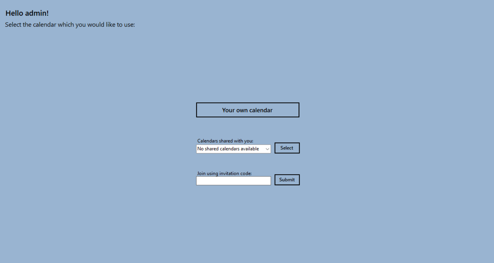
<figcaption>Okno wyboru kalendarza</figcaption>
</figure>

Po wciśnięciu swojego kalendarza, wybraniu z listy udostępnionych
kalendarzy lub wpisaniu kodu zaproszenia użytkownik zostaje przeniesiony
do głównego widoku kalendarza.

<figure data-latex-placement="H">
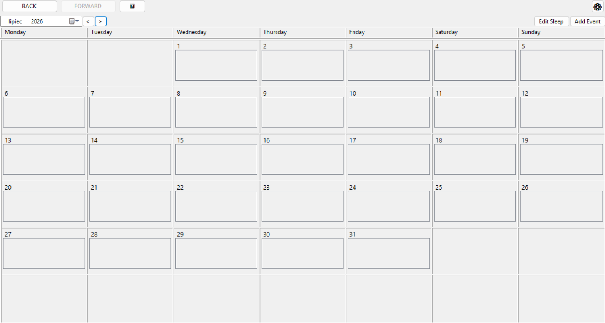
<figcaption>Okno kalendarza</figcaption>
</figure>

Po wciśnięciu zębatki w prawy górnym rogu pokażę się okno ustawień.
Możemy tutaj wylogować się, wyjść z aplikacji oraz modyfikować
uprawnienia dotyczące uprawnień. Aby udostępnić kalendarz wystarczy
udostępnić kod lub poprzez dodanie adresu e-mail do listy. Aby usunąć
uprawnienie wystarczy wcisnąć klawisz scrolla na myszcę.

<figure data-latex-placement="H">
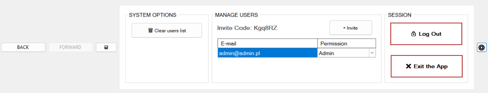
<figcaption>Okno ustawień</figcaption>
</figure>

Po wciśnięciu dnia otworzy się jego dokładna oś czasu. Możemy stąd
edytować lub dodawać nowe wydarzenia. Dodatkowo możemy edytować listę
zadań do zrobienia. Podwójny lewy przycisk dodaje zadanie do zakładki,
lewy edytuje, środkowy usuwa.

<figure data-latex-placement="H">
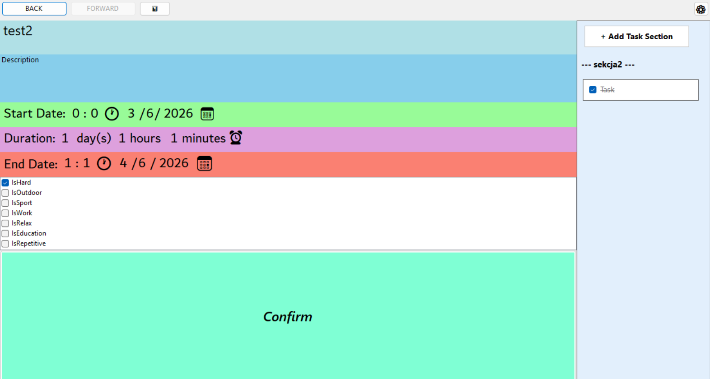
<figcaption>Okno podglądu i edycji zdarzenia</figcaption>
</figure>

Na pasku mamy przycisk, ktory umożliwia nam przejście do zakładki z
wykresami.

<figure data-latex-placement="H">
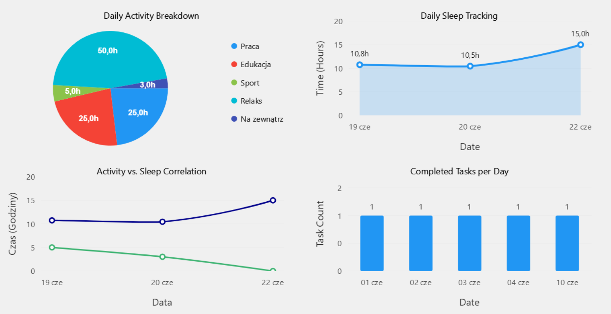
<figcaption>Okno statystyk</figcaption>
</figure>

# Testowanie\*

## Scenariusze testowe

::: longtable
\|c\|p6cm\|p5cm\|

\
Nr & Scenariusz & Oczekiwany wynik\
**Table  -- Kontynuacja z poprzedniej strony**\
Nr & Scenariusz & Oczekiwany wynik\
T1 & Walidacja niepoprawnych formatów roku, np. ciągów znaków (,,abc")
lub lat spoza dopuszczalnego zakresu. & Zwrócenie wartości prawda (true)
oznaczającej błąd walidacji.\
T2 & Usunięcie wydarzenia z kalendarza, które ma przypisane do siebie
zadanie do zrobienia (TodoItem). & Skuteczne usunięcie z bazy danych
zarówno wydarzenia (CalendarEvent), jak i powiązanego zadania
(TodoItem).\
T3 & Obliczenie wysokości w interfejsie dla wydarzenia (w pikselach),
które kończy się dopiero następnego dnia. & Ucięcie wysokości wydarzenia
równo do godziny 24:00 (północy).\
T4 & Wyznaczenie kolumn interfejsu dla wydarzeń, które nakładają się na
siebie czasowo w widoku dnia. & Automatyczne rozmieszczenie
konfliktowych wydarzeń w osobnych kolumnach.\
T5 & Przypisanie koloru wizualnego wydarzenia na podstawie włączonych
flag kategorii, np. IsHard, IsWork. & Zwrócenie odpowiedniej wartości
koloru w formacie RGB na podstawie włączonych flag.\
T6 & Próba dodania do kalendarza nowego wydarzenia, którego czas
rozpoczęcia nie jest w formacie UTC. & Przerwanie operacji i wyrzucenie
wyjątku informującego o konieczności użycia czasu UTC.\
T7 & Zapisanie nowo utworzonego wydarzenia bez powiązanego z nim zadania
Todo. & Dodanie wydarzenia do bazy danych i pomyślne wykonanie nawigacji
do widoku wybranego dnia.\
T8 & Dodanie nowego rekordu zadania (TodoItem) do bazy danych. &
Pomyślne zapisanie obiektu, nadanie mu unikalnego ID i zwiększenie
ogólnej liczby obiektów w bazie.\
T9 & Dodanie nowego użytkownika (User) do systemu. & Utworzenie konta
użytkownika, automatyczne utworzenie powiązanego kalendarza oraz
wygenerowanie unikalnego kodu zaproszenia.\
T10 & Pobieranie przefiltrowanej listy użytkowników. & Zwrócenie listy
zawierającej wyłącznie użytkowników spełniających zadane kryteria (np.
wyszukiwanie po imieniu).\
T11 & Pobranie wszystkich rekordów konkretnego typu z bazy (np.
TodoItem). & Zwrócenie poprawnej listy wszystkich zapisanych obiektów
zadeklarowanego typu.\
T12 & Usunięcie istniejącego rekordu z bazy na podstawie jego unikalnego
ID oraz typu. & Skuteczne, trwałe usunięcie obiektu (ponowne zapytanie
zwraca pustą listę).\
T13 & Aktualizacja właściwości istniejącego rekordu na podstawie jego
ID. & Pomyślne zapisanie i utrwalenie nowych wartości (np. nowego opisu
zadania) w bazie danych.\
T14 & Pobranie istniejących uprawnień użytkownika przypisanych do
konkretnego kalendarza. & Zwrócenie prawidłowego, zapisanego poziomu
uprawnień (np. Edit).\
T15 & Próba pobrania uprawnień dla użytkownika, który nie posiada
żadnych ról w danym kalendarzu. & Zwrócenie domyślnego statusu
zablokowanego dostępu (Blocked).\
T16 & Analiza prawidłowych ram czasowych snu z przełomu dwóch dni. &
Poprawne wyliczenie liczby przespanych godzin i przypisanie ich do dnia
pobudki.\
T17 & Analiza danych dotyczących snu zawierających anomalie (ujemny czas
trwania lub sen powyżej 24 godzin). & Zignorowanie nieprawidłowych
danych i całkowite odrzucenie wartości odstających ze statystyk.\
T18 & Kalkulacja i kategoryzacja czasu spędzonego na poszczególnych
wydarzeniach (np. Praca, Relaks). & Prawidłowe zsumowanie godzin dla
każdej z kategorii na podstawie ustawionych flag w kalendarzu.\
T19 & Sumowanie czasu poświęconego na łączną aktywność sportową i
plenerową w widoku dnia. & Zwrócenie sumy czasu trwania wydarzeń
oznaczonych flagami isSport oraz isOutdoor.\
T20 & Analiza zrealizowanych zadań na podstawie wydarzeń kalendarzowych
powiązanych z TodoId. & Poprawne zliczenie zdarzenia i uwzględnienie go
w statystykach ukończonych zadań na dany dzień.\
T21 & Analiza statystyczna wydarzenia kalendarzowego z niepoprawnym
(ujemnym) czasem trwania. & Całkowite zignorowanie zdarzenia -- brak
modyfikacji statystyk czasowych dla jakiejkolwiek kategorii.\
:::

## Wyniki testów

Testy jednostkowe zostały napisane przy użyciu biblioteki xUnit. Aby móc
testować klasy wymagające pewnych zależności dodaliśmy bibliotekę Moq
służącą do tworzenia sztucznych klas, które możemy przekazać do naszych
testowanych obiektów.\
Wykonaliśmy 59 testów jednostkowych na 3 głównych klasach
*DatabaseService*, *CalendarModel* oraz *AnalysisService*.\
Całość wykonała się w 3.8 sekundy oraz zwróciła 0 błędów. Uzyskane
wyniki potwierdzają poprawność działania naszych klas w sytuacjach
codziennych oraz skrajnych.

# Napotkane problemy

1.  Wystąpiło wiele problemów z synchronizacją pomiędzy bazą danych a
    pamięcią lokalną.

2.  Zastosowane sposoby detekcji zmian w bazie danych działały jedynie
    lokalnie.

3.  Problemy z połączeniem ze zdalną bazą danych

4.  Dependency Injection tworzyło kilkukrotnie singletony

5.  Elementy LiveCharts psuły skale DPI aplikacji.

# Wnioski

- Osiągnięto zakładane cele.

- Skutecznie zastosowaliśmy architekturę MVP oraz skorzystaliśmy z
  łatwości wymiany poszczególnych klas.

- Zastosowano programowanie obiektowe.

- Wykorzystano interfejs graficzny.

- Poprawnie udało się zaimplementować dzielenie kalendarza zdalnie.

- Udało sie zaimplementować dynamiczne odświeżanie.

- Utworzono strukturę gotową na dalsze rozwoje.

- Poprawnie ustawiono czas potrzebny na wykonanie projektu.

- Udało sie podzielić zadania, aby mogły być wykonywane jednocześnie.

# Bibliografia

1.  Materiały wykładowe z przedmiotu Programowanie Obiektowe i Graficzne

2.  **Dokumentacja bazy danych Neon**\
    <https://neon.com/docs/introduction>

3.  **Dependency Injection**\
    <https://learn.microsoft.com/en-us/dotnet/api/microsoft.extensions.dependencyinjection.servicecollection?view=net-11.0-pp>

4.  **Forum stackoverflow**\
    <https://stackoverflow.com/questions>

5.  **Kurs PostgreSQL**\
    <https://www.w3schools.com/postgresql/>

# Utworzenie Bazy danych

1.  Zainstalować i uruchomić lokalny serwer PostgreSQL.

2.  Zaimportować dołączony plik `kopia_bazy.sql`, który utworzy
    strukturę tabel oraz potrzebne wyzwalacze.

3.  Przygotować lokalny ciąg połączeniowy (Connection String).

4.  Wkleić Connection String do pliku konfiguracyjnego
    `resources/appsettings.json` w polu `NeonDatabase`.
